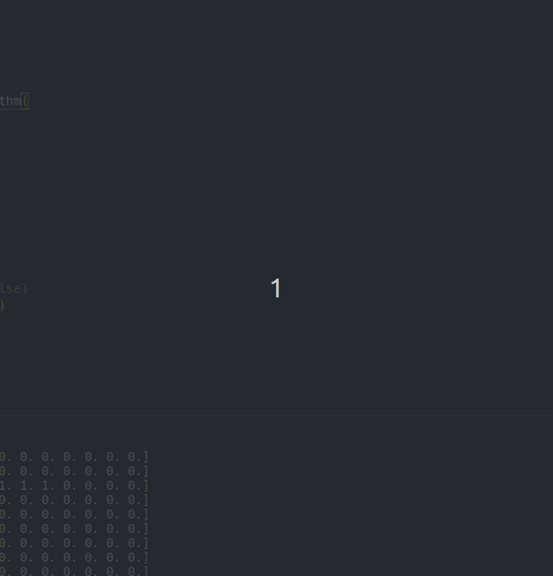

# Algorithme génétique : Snake

## Fonctionnel

Le but de ce projet est la création d'un algorithme génétique adapté à la maximisation d'un score au jeu de snake.
Ainsi, le programme génère des "individus" aléatoires modélisés par de simple réseaux de neurones à propagation avant. Une selection des meilleurs individus est ensuite réalisée afin d'en générer de nouveaux. Au bout de plusieurs générations, les performances des individus convergeront vers le meilleur score possible étant donné les paramètres.

## Technique

#### Installation

Toutes les libraires nécéssaires sont dans le fichier `requirements.txt`, une fois installées il suffit d'éxecuter le fichier `main.py`.
Créer et activer un environnement virtuel afin de séparer les dépendances python du projet de celles de votre machine.

Initialiser ensuite le projet en entrant la commande suivante :
```bash
$ make init
```

#### Exécuter le programme
Vous pouvez, dans ce fichier `main.py`, modifier les paramètres afin de visualiser leur impact sur les résultats.
Par défaut, le code affichera l'avancement des générations dans le terminal ainsi que les scores de chaque individus. Toutes les 100 générations, vous pourrez appuyer sur une touche du clavier afin de visualiser les 3 meilleurs individus dans une interface pygame.

<p align="center">

</p>

L'issue de l'éxecution sera variable de par le fait que l'évolution de la population est en partie aléatoire. Il vous faudra donc peut être relancer le programme plusieurs fois avant d'avoir des résultats concluants.